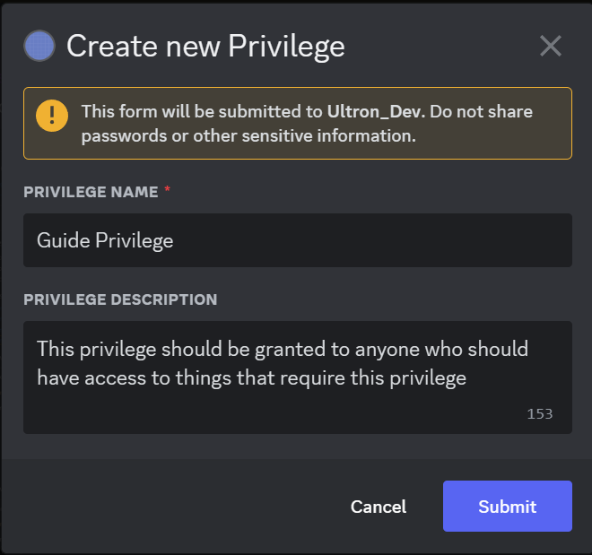
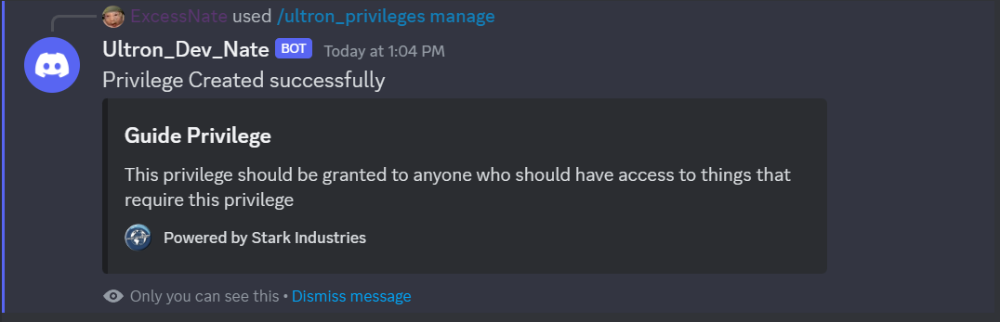
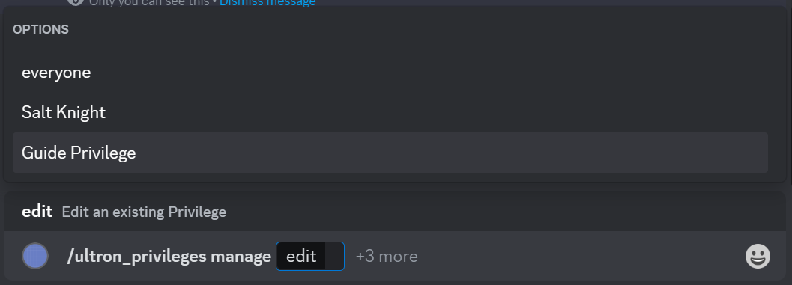
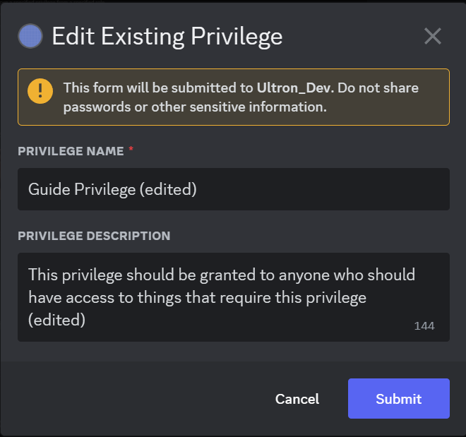
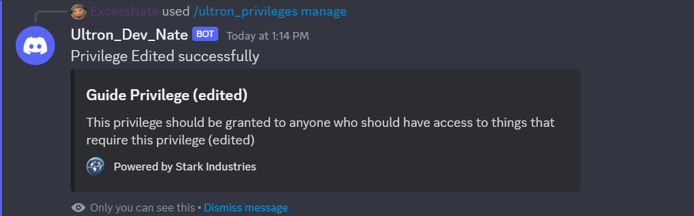

# Ultron Guide:

## Table of Contents:
- Modules
    - [Privileges](#privileges-module)
    - [Comp-Docs](#comp-docs-module)
- Guides
    - [Creating A New Privilege](#creating-a-new-privilege)
    - [Edit An Existing Privilege](#edit-an-existing-privilege)
---
# Modules
## Privileges Module:
[[Table of Contents](#table-of-contents)]

This set of commands is used to add/remove roles to privileges. Privileges are implemented to grant access to various features in a collective manner. If privilege has access to a command or feature any roles, and by extension any member with any of those roles will automatically gain access to that command or feature. This is done so access can be easily granted to multiple roles at once, or to be able to grant a role access to multiple feature at once.

### Commands:
- [/ultron_privileges grant](#ultron_privileges-grant)
- [/ultron_privileges revoke](#ultron_privileges-revoke)
- [/ultron_privileges manage](#ultron_privileges-manage)
- [/ultron_privileges view_membership](#ultron_privileges-view_membership)

### /ultron_privileges grant
---
Grants a specified privilege to a specified role.

Usage: `/ultron_privileges grant {privilege|<privilege>}* {role|<role>}*`
 - Options:
    - privilege
        - required -> yes
        - autocomplete -> yes
    - role
        - required -> yes
        - autocomplete -> yes
- Interaction -> None
- Result -> confirmation message
- Ephemeral -> yes

### /ultron_privileges revoke
---
Revoke/Remove a specified privilege from a specified role.

Usage: `/ultron_privileges revoke {privilege|<privilege>}* {role|<role>}*`
 - Options:
    - privilege
        - required -> yes
        - autocomplete -> yes
    - role
        - required -> yes
        - autocomplete -> yes
- Interaction -> None
- Result -> confirmation message
- Ephemeral -> yes

### /ultron_privileges manage
---
Manage a specific privilege

Usage: `/ultron_privileges manage {create|<privilege>} {edit|<privilege>} {delete|<privilege>} {view|<privilege>}`
- Options: Requires exactly 1 of 4
    - create -> create a new privilege
        - autocomplete -> no
        - requires new unique name
    - edit -> modify an existing privilege
        - autocomplete -> yes
    - delete -> delete an existing privilege
        - autocomplete -> yes
    - view -> view details of an existing privilege
- Interactions:
    - create -> Modal
    - edit -> Modal
    - delete -> None
    - view -> None
- Results:
    - create -> Embed of new privilege
    - edit -> Embed of modified privilege
    - delete -> confirmation message
    - view -> Embed of privilege to view
- Ephemeral:
    - create -> yes
    - edit -> yes
    - delete -> yes
    - view -> yes

### /ultron_privileges view_membership
---
View the all roles with a specified privilege, or all privileges granted to a specific role

Usage: `/ultron_privileges view_membership {privilege|<privilege>} {role|<role>}`
- Options -> Requires exactly 1 of 2
    - privilege -> show all roles with specified privilege
        - autocomplete -> yes
    - role -> show all privileges granted to specified role
        - autocomplete -> yes
- Interaction -> None
- Result -> Embed of privileges or roles
- Ephemeral -> yes

---
## Comp Docs Module:
[[Table of Contents](#table-of-contents)]

This set of commands is for creating and modifying easily accessible documents for users to refer to. Documents can be restricted via [privileges](#privileges-module) to limit which users have access to view them

### Commands:
- [/ultron_view_comp_info](#ultron_view_comp_info)
- [/ultron_comp_info add_restriction](#ultron_comp_info-add_restriction)
- [/ultron_comp_info remove_restriction](#ultron_comp_info-remove_restriction)
- [/ultron_comp_info view_restrictions](#ultron_comp_info-view_restrictions)
- [/ultron_comp_info manage](#ultron_comp_info-manage)

### /ultron_view_comp_info
---

View a specific document

Usage: `/ultron_view_comp_info {doc|<document_name>}*`
- Options:
    - doc -> name of document to view
        - required -> yes
        - autocomplete -> yes
- Interaction -> None
- Result -> Embed of document
- Ephemeral -> yes

### /ultron_comp_info add_restriction
---
Add a restriction to a specified document by granting it a privilege. Only roles with that privilege will be able to view the document. Documents will have no restrictions on creation, for security reasons nobody other than admins will be able to view a new document until restrictions are added.

Usage: `/ultron_comp_info add_restriction {doc|<document_name>}* {privilege|<privilege>}*`
- Options:
    - doc -> name of document to add restriction to
        - required -> yes
        - autocomplete -> yes
    - privilege -> privilege to add as restriction
        - required -> yes
        - autocomplete -> yes
- Interaction -> None
- Result -> Confirmation Message
- Ephemeral -> yes

### /ultron_comp_info remove_restriction
---
Remove a restriction from a specified document

Usage: `/ultron_comp_info add_restriction {doc|<document_name>}* {privilege|<privilege>}*`
- Options:
    - doc -> name of document to remove restriction from
        - required -> yes
        - autocomplete -> yes
    - privilege -> privilege to remove
        - required -> yes
        - autocomplete -> yes
- Interaction -> None
- Result -> Confirmation Message
- Ephemeral -> yes

### /ultron_comp_info view_restrictions
---
View all restrictions granted to a specified document

Usage: `/ultron_comp_info view_restrictions {doc|<document_name>}*`
- Options:
    - doc -> name of document to view restrictions of
        - required -> yes
        - autocomplete -> yes

- Interaction -> Modal
- Result -> Embed of assigned restrictions
- Ephemeral -> yes

### /ultron_comp_info manage
---

Manage (create, edit, delete) a specified document

Usage: `/ultron_comp_info manage {create|<document_name>} {edit|<document_name>} {delete|<document_name>}`
- Options: Requires exactly 1 of 3
    - create -> create a new document
        - autocomplete -> no
        - requires new unique name
    - edit -> edit/modify a specified document
        - autocomplete -> yes
    - delete -> delete a specified document
        - autocomplete -> yes
- Interactions:
    - create -> Modal
    - edit -> Modal
    - delete -> None
- Results:
    - create -> Embed of new document
    - edit -> Embed of modified document
    - delete -> confirmation message
- Ephemeral:
    - create -> yes
    - edit -> yes
    - delete -> yes

# Guides
## Creating A New Privilege
---

[[Table of Contents](#table-of-contents)]

Pick a name for the new privilege and execute `/ultron_privileges manage create <privilege_name>`

Enter a description for the privilege in the modal that appears and then submit

You should receive an embed of the new privilege you just created

## Edit An Existing Privilege
---

[[Table of Contents](#table-of-contents)]

Decide which privilege you want to edit and execute `/ultron_privileges manage edit <privilege_name>` selecting which the proper privilege from the list

Edit privilege in the resulting modal, you can change both the name and description as wanted.

Click submit and you should receive an embed of the newly modified privilege 

## Delete An Existing Privilege
--

[[Table of Contents](#table-of-contents)]

Note: Deleting a privilege is final and non-reversable! 

To delete

